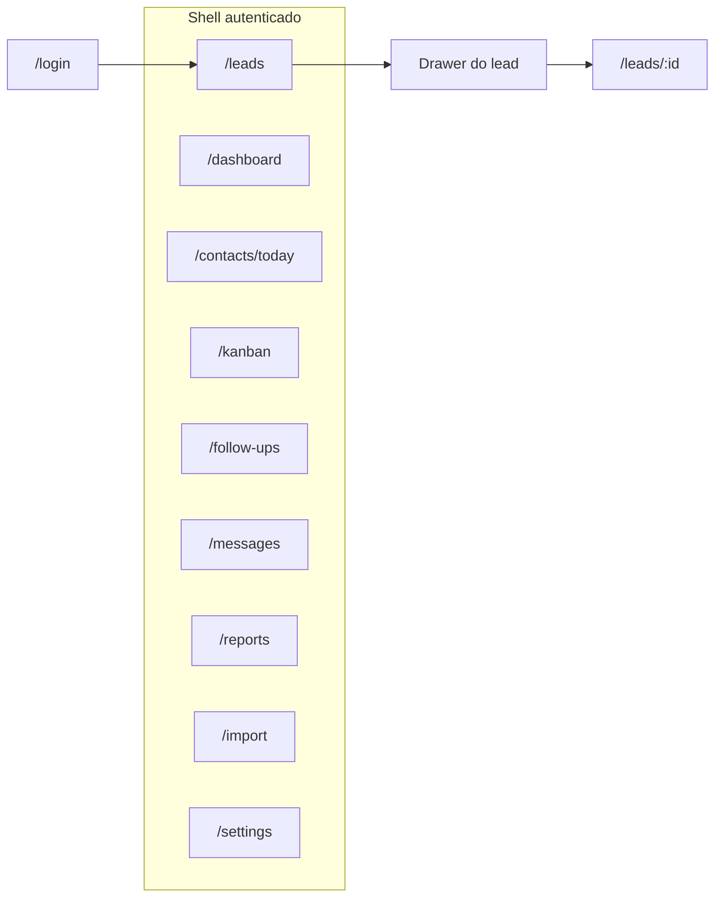
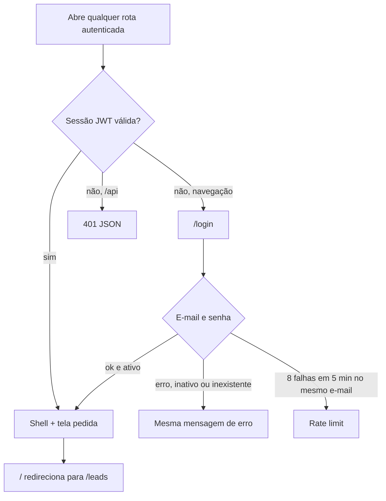
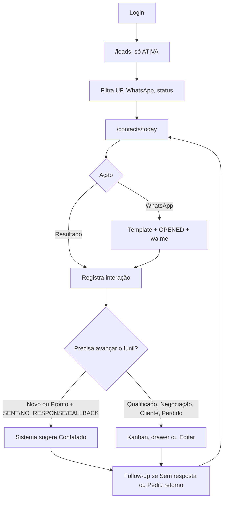
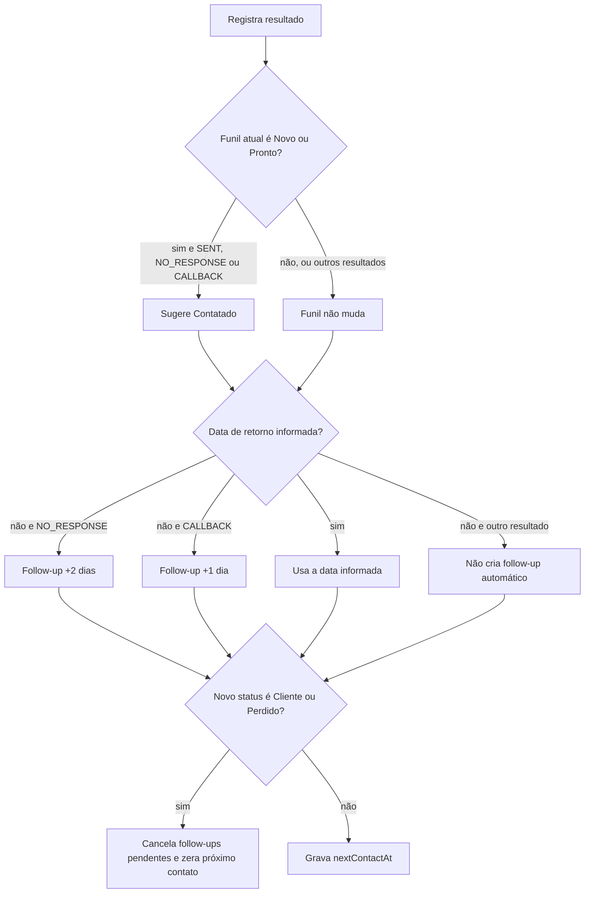
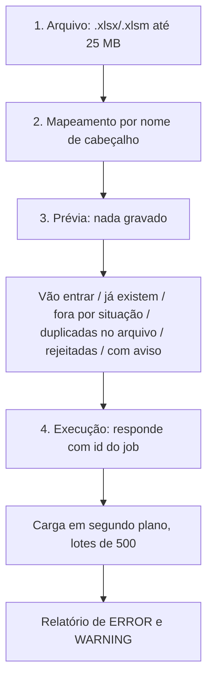
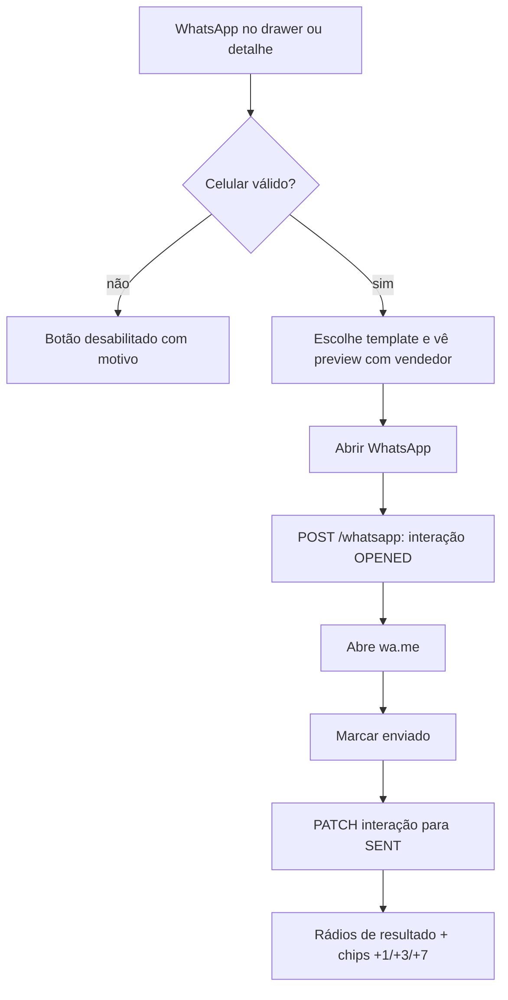
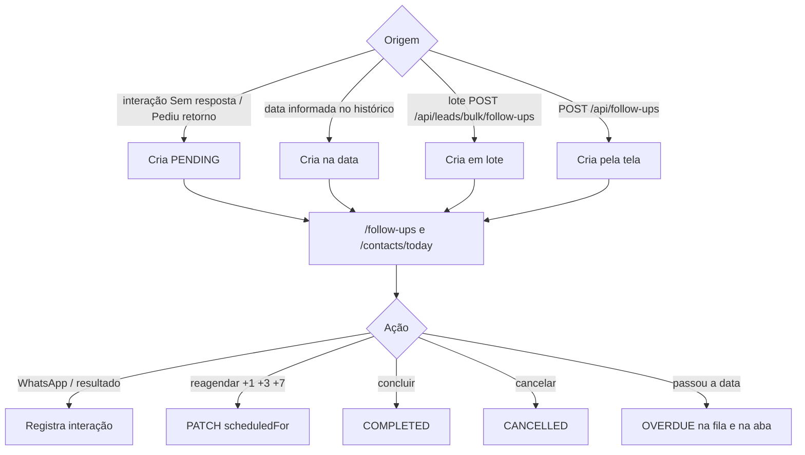
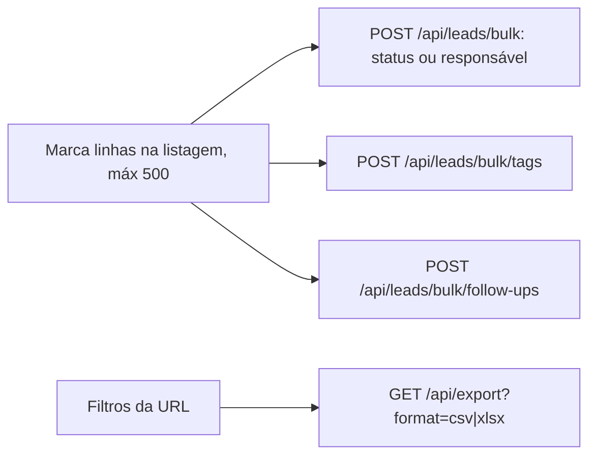

# PRD — CRM de Prospecção

Documento de requisitos de produto e fluxos de tela. Descreve o sistema **como existe** na versão 0.13.0 (03/09/2026). Não é wishlist.

| Item | Valor |
| --- | --- |
| Produto | CRM de Prospecção (interno, web) |
| Versão documentada | 0.13.0 — Campanhas, Inbox e QR Evolution |
| Plataforma | Web desktop (modo Operate) |
| Data | 03/09/2026 |

## Papel deste arquivo

| Arquivo | Papel |
| --- | --- |
| **Este PRD** | Requisitos, usuários, escopo, fluxos de tela, critérios de aceite |
| [`DOCUMENTACAO-SISTEMA.md`](DOCUMENTACAO-SISTEMA.md) | Fonte oficial de **comportamento** (campo → regra → código). Se a tela divergir daquela fonte, um dos dois está errado |
| [`docs/como-usar-o-sistema.md`](docs/como-usar-o-sistema.md) | Tutorial do cliente (Admin / Vendedor / Gestor, botão a botão) + apêndice de TI |
| [`PRODUCT.md`](PRODUCT.md) | Briefing de produto (Impeccable) |
| [`DESIGN.md`](DESIGN.md) | Direção visual |

Mapa campo a campo, validações e paths de código: seção 6 de `DOCUMENTACAO-SISTEMA.md`. Este PRD não duplica essas tabelas.

---

## 1. Problema e propósito

### 1.1 Problema

O time de vendas recebe planilhas exportadas de consulta de CNPJ (Receita) e precisa prospectar em volume. Sem ferramenta, o histórico some no WhatsApp e na planilha: ninguém sabe quem foi contatado, com que resultado, nem quando voltar.

### 1.2 Propósito

Transformar a base importada em operação de prospecção outbound rastreável: quem foi contatado, por qual canal, com que resultado, e qual é o próximo passo com data.

A base de empresas é **insumo**. O valor está no histórico de contato e na fila priorizada do dia (`atrasado → hoje → lead novo → futuro`).

### 1.3 Sucesso

O vendedor termina o turno sem lead esquecido:

- nenhuma empresa contatada sem resultado registrado;
- nenhum follow-up vencido invisível.

### 1.4 O que o sistema não é

- Dashboard de métricas como produto principal.
- Site, landing ou CRM genérico de cadastro.
- Envio automático de WhatsApp **via campanha** (fila + gateway). O fluxo manual `wa.me` em Leads permanece.
- Multiempresa, cobrança SaaS ou app nativo.

---

## 2. Usuários e papéis

Usuário primário: **vendedor de prospecção ativa**. Abre o sistema no começo do turno e permanece nele. Lê rápido, compara linhas, trabalha em monitor desktop com as duas mãos no teclado.

| Papel | Rótulo | Enxerga | Escreve | Reatribui | Importa | Administra usuários |
| --- | --- | --- | --- | --- | --- | --- |
| `USER` | Vendedor | leads próprios + sem responsável | leads próprios + sem responsável | não | não | não |
| `MANAGER` | Gestor | toda a base | qualquer lead | sim | sim | não |
| `ADMIN` | Administrador | toda a base | qualquer lead | sim | sim | sim |

**Limitação conhecida:** não existe entidade `Team`. O gestor enxerga a mesma base que o administrador. Quando `Team` existir, o recorte passa a ser `responsavelId` nos membros da equipe.

Autorização é decidida **só no servidor** (`src/lib/auth/rbac.ts`). O middleware apenas redireciona navegação sem sessão; requisição `/api/*` sem sessão recebe 401 JSON, não o HTML do login.

---

## 3. Escopo

### 3.1 Dentro (entregue, fases 1–9)

- Login por e-mail e senha, sessão JWT de 8 horas, três papéis.
- Importação de `.xlsx` / `.xlsm` (até 25 MB) em quatro passos, job retomável, deduplicação por CNPJ.
- Listagem de leads com filtros na URL, paginação, ordenação, ações em lote (status, responsável, tag, follow-up).
- Drawer do lead + página completa `/leads/:id` (edição, funil, histórico).
- Dashboard com 8 KPIs de COUNT, funil HTML clicável, atividade de hoje e próximas 8 ações.
- Kanban a partir de Contatado (Novo e Pronto ficam em Leads); arrastar para mudar status, filtros da listagem, modo compacto.
- Fila do dia (`/contacts/today`) priorizada e paginada no servidor.
- Follow-ups com abas Atrasados / Hoje / Próximos / Todos, COUNT + página 50.
- Templates de mensagem (CRUD para ADMIN/MANAGER; USER só lê e usa).
- Relatórios de produtividade no intervalo + exportação CSV/XLSX.
- Configurações: conta, estado do Redis, atalhos; ADMIN cria/edita usuários.
- Teclado operacional, paleta de comandos, auditoria, SSE de invalidação (Redis).

### 3.2 Fora / backlog (não implementado)

Ver seção 9. Nenhum botão finge funcionar: o que falta aparece como `NotImplemented` com a fase.

### 3.3 Fonte de dados atual

Duas planilhas XLSX (consulta de CNPJ), aba `empresas`, ~3.306 empresas (SP, GO, DF). Situações cadastrais: ATIVA, BAIXADA, INAPTA, SUSPENSA, NULA. Canal principal de contato: WhatsApp Web via `wa.me`.

---

## 4. Princípios de produto

1. **Nada desaparece em silêncio.** Lead filtrado, linha rejeitada na importação e duplicado aparecem com contagem e motivo.
2. **O próximo passo é sempre visível.** Lead em andamento tem status e, quando aplicável, data de próximo contato.
3. **Densidade acima de conforto visual.** Tabela densa, monoespaçado em dado técnico, largura inteira do monitor.
4. **O servidor é a autoridade.** Permissão, filtro e regra de negócio resolvem no servidor.
5. **Interface honesta.** Funcionalidade inexistente é marcada como não implementada, com a fase em que chega.
6. **Funil e resultado são conceitos distintos.** Cor de funil nunca é reaproveitada como resultado de interação, nem o contrário.

---

## 5. Mapa de telas e navegação

Menu lateral: [`src/constants/navigation.ts`](src/constants/navigation.ts). `/` redireciona para `/leads`. Sem sessão → `/login`.



`/import` só aparece no menu para ADMIN e MANAGER. USER que abrir a rota recebe estado sem permissão.

### 5.0 Shell autenticado (referência)

Todas as rotas autenticadas compartilham a mesma casca. Os wireframes das seções 5.1 mostram **apenas o conteúdo** dentro da área principal; o shell abaixo é a referência comum.

```
+------------------------------------------------------------------+
| SIDEBAR              | TOPBAR (h-11)                             |
| (w-sidebar)          | CRM Prospecção | [Buscar... Ctrl K] | Tema|
|                      | Iniciais -> Sair                          |
| Operacao:            +------------------------------------------+
|  Leads               | PAGE HEADER (titulo + count + acoes)     |
|  Contatos            +------------------------------------------+
|  Follow-ups          |                                          |
|  Kanban              |         CONTEUDO DA TELA                 |
| ----                 |         (wireframe abaixo)               |
| Visao:               |                                          |
|  Dashboard           |                                          |
|  Relatorios          |                                          |
|  Mensagens           |                                          |
| ----                 |                                          |
| Sistema:             |                                          |
|  Importar (A/M)      |                                          |
|  Configuracoes       |                                          |
+------------------------------------------------------------------+
```

Camadas flutuantes (drawer ~448px, dialog, popover, paleta Cmd+K) sobrepõem o conteúdo sem alterar o shell.

### 5.1 Fichas por tela

#### `/login`

| Item | Conteúdo |
| --- | --- |
| Objetivo | Entrar no turno |
| Quem | Qualquer pessoa com conta ativa |
| Campos | E-mail (obrigatório, minúsculas), senha (obrigatória) |
| Regras | Usuário inexistente, inativo e senha errada devolvem a mesma mensagem. Rate limit: 8 tentativas / 5 min **por e-mail** |
| Depois | Redireciona para a aplicação; `/` vai para `/leads` |
| API | Auth.js Credentials (`/api/auth/*`) |

**Wireframe** (tela isolada, sem shell):

```
+------------------------------------------+
|                                          |
|         CRM Prospecção                   |
|         Entre com a conta cadastrada...  |
|                                          |
|         +------------------------+       |
|         | E-mail                 |       |
|         +------------------------+       |
|         | Senha                  |       |
|         +------------------------+       |
|         |        [ Entrar ]      |       |
|         +------------------------+       |
|                                          |
+------------------------------------------+
```

#### `/dashboard`

| Item | Conteúdo |
| --- | --- |
| Objetivo | Primeiro olhar do recorte: volume e funil |
| Quem | Todos os papéis (recorte pelo escopo) |
| Primeiro viewport | FilterBar (Status, UF, Responsável, Período, WhatsApp, E-mail, última interação, próxima ação, Mais); 8 KPIs de COUNT (Leads, WhatsApp, Para contato hoje, Contatados, Responderam, Qualificados, Clientes, Follow-ups atrasados); funil HTML |
| Abaixo | Atividade de hoje (COUNT) e próximas 8 ações |
| Regras | Clique no KPI ou na barra aplica filtro na URL. Sem gráfico de UF/responsável/7 dias (fica em Relatórios). Sem mock nem variação percentual inventada |
| API | `GET /api/dashboard` |

**Wireframe**:

```
+----------------------------------------------------------+
| Dashboard                                     3.306 leads|
|                      Clique no KPI...  [Limpar filtros]  |
+----------------------------------------------------------+
| [Filtro] [Ordenar] [Opcoes]  chips: Status: Pronto ...   |
+----------------------------------------------------------+
| KPI1 | KPI2 | KPI3 | KPI4 | KPI5 | KPI6 | KPI7 | KPI8   |
| Leads| Wa   | Hoje | Cont | Resp | Qual | Cli  | Atras  |
+----------------------------------------------------------+
| FUNIL (barras clicaveis)     | ATIVIDADE HOJE            |
| Novo      ████████ 1200      | 12 interacoes             |
| Pronto    ██████ 800         +---------------------------+
| Contatado ████ 500           | PROXIMAS 8 ACOES          |
| Qualif    ███ 200            | Empresa A - 03/09         |
| ...                          | Empresa B - 04/09         |
+----------------------------------------------------------+
```

#### `/leads`

| Item | Conteúdo |
| --- | --- |
| Objetivo | Filtrar, comparar e abrir empresas |
| Quem | Todos (USER só vê próprios + sem responsável) |
| Filtro padrão | Situação cadastral **ATIVA**. Faixa informa quantas ficaram de fora, com botão *Mostrar todas* |
| Colunas | Checkbox, Empresa, CNPJ, Contato, Telefone, WhatsApp, Cidade/UF, Status (funil), Responsável, Próxima ação, Última interação, Ações (WhatsApp) |
| Ações | Clique / Enter abre o drawer. `e` e Editar vão para `/leads/:id?edit=1`. `w` foca Próxima ação no drawer. `x` marca linha |
| Lote | Mudar status e atribuir responsável, no máximo 500. Trocar página ou filtro limpa a seleção |
| Estado | Filtros na querystring (link compartilhável, voltar e F5 preservam). Filtrar no cliente é proibido |
| API | `GET /api/leads`, `GET /api/leads/facets`, `POST /api/leads/bulk`, `POST /api/leads/bulk/tags`, `POST /api/leads/bulk/follow-ups` |

**Wireframe**:

```
+----------------------------------------------------------+
| Leads                                    2.610 no filtro |
+----------------------------------------------------------+
| [Busca...] [Filtro] [Ordenar] [Opcoes]                   |
| chips: UF: SP  Status: Pronto  Responsavel: Ana          |
+----------------------------------------------------------+
| 696 empresas fora...                    [Mostrar todas]  |
+----------------------------------------------------------+
| [x]|Empresa |CNPJ |Tel |Wa |Cidade|Status|Resp|Prox|Res |
| [ ]|Avatar..|.....|....|...|SP    |Novo  |Ana | -- | -- |
| [ ]|Avatar..|.....|....|...|GO    |Pronto|--  |03/9|SENT|
| ...                                            |Wa |    |
+----------------------------------------------------------+
| < 1 2 3 ... >                                            |
| [N selecionados] Mudar status | Atribuir | Tag | Follow-up|
+----------------------------------------------------------+
```

#### Drawer do lead (camada sobre `/leads`, `/kanban`, `/contacts/today`, `/follow-ups`)

| Item | Conteúdo |
| --- | --- |
| Objetivo | Agir no lead sem sair da lista |
| Layout | ~448px à direita. Identidade + empresa/contato + timeline. Rodapé: loop WhatsApp, status, próximo contato, Editar |
| WhatsApp no header | Rola até o rodapé; **não** abre `wa.me` direto |
| Editar | Abre `/leads/:id?edit=1` |
| Mais | Abrir página completa |
| API | `GET /api/leads/:id` |

**Wireframe** (sheet ~448px à direita, lista escurecida atrás):

```
                    +---------------------------+
[Lista / Kanban]    | [X] Avatar  Razao Social  |
                    |           Nome Fantasia   |
                    | CNPJ      | 00.000.000/00 |
                    | WhatsApp  | (11) 99999... |
                    | Telefone  | (11) 3333...  |
                    | Status    | [Pronto v]    |
                    | Proximo   | [03/09/2026]  |
                    | Respons.  | [Ana v]       |
                    +---------------------------+
                    | TIMELINE                  |
                    | WhatsApp | SENT | 02/09   |
                    | Telefone | Sem r.| 01/09  |
                    +---------------------------+
                    | PROXIMA ACAO              |
                    | [Template v]  [Preview]   |
                    | [Abrir WhatsApp]          |
                    | [Marcar enviado]          |
                    | Resultado: ( ) Respondeu  |
                    |            ( ) Sem resp.  |
                    | +1d +3d +7d               |
                    |              [Editar]     |
                    +---------------------------+
```

#### `/leads/:id`

| Item | Conteúdo |
| --- | --- |
| Objetivo | Edição completa, deep link, dados da Receita |
| Quem | Quem tem o lead no escopo |
| Leitura | CNPJ, situação cadastral, natureza jurídica, CNAEs, sócios, capital, Simples/MEI |
| Editável | Contato, endereço, segmento, porte, origem, observações. PATCH só dos campos alterados |
| Salva na hora | Status, próximo contato, responsável |
| Histórico | Canal, resultado, anotação, agendamento de retorno |
| API | `GET/PATCH /api/leads/:id`, `GET/POST /api/leads/:id/interactions`, `PATCH /api/leads/:id/status`, `POST /api/leads/:id/whatsapp` |

**Wireframe**:

```
+----------------------------------------------------------+
| Empresa XYZ Ltda                           [Editar]      |
+----------------------------------------------------------+
| EMPRESA          | CONTATO          | ENDERECO            |
| CNPJ             | Telefone         | Logradouro          |
| Situacao ATIVA   | WhatsApp         | Numero / Compl.     |
| Razao social     | E-mail           | Bairro              |
| Nome fantasia    |                  | Cidade / UF / CEP   |
| Natureza jurid.  |                  | IBGE                |
| Abertura         |                  |                     |
| Capital social   |                  |                     |
| Porte / Simples  |                  |                     |
+----------------------------------------------------------+
| ATIVIDADE ECON.  | SOCIOS           | FUNIL (salva hora)  |
| CNAE principal   | Socio 1          | Status [v]          |
| Segmento         | Socio 2          | Proximo [date]      |
| CNAEs secund.    |                  | Responsavel [v]     |
+----------------------------------------------------------+
| RASTRO           | OBSERVACOES (editavel)                   |
| Cadastrado       | [________________________________]       |
| Atualizado       |                                          |
| Ultimo contato   |                                          |
| Origem           |                                          |
+----------------------------------------------------------+
| HISTORICO DE INTERACOES                    [+ Registrar]  |
| WhatsApp | Mensagem enviada | 02/09 | nota...           |
| Telefone | Sem resposta     | 01/09 | retorno 03/09     |
+----------------------------------------------------------+
```

#### `/kanban`

| Item | Conteúdo |
| --- | --- |
| Objetivo | Ver e mover o funil |
| Colunas | 7 status, 40 cards por página, *Carregar mais*. Encerrados liga Cliente/Perdido |
| Ações | Arrastar chama mudança de status. Duplo clique abre o drawer. Filtros da listagem na API |
| Card | Empresa, cidade/UF, telefone, ResultBadge, responsável, próxima ação. Modo compacto no IndexedDB |
| API | `GET /api/kanban` (`column` + filtros), `PATCH /api/leads/:id/status` |

**Wireframe**:

```
+----------------------------------------------------------+
| Kanban          Arraste o card... [Compacto] [Encerrados]|
+----------------------------------------------------------+
| [Filtro] [Ordenar] [Opcoes]  chips: UF: SP ...           |
+----------------------------------------------------------+
| Novo     | Pronto   | Contat.  | Qualif.  | Negoc.  |... |
| +-------+| +-------+| +-------+| +-------+| +-------+|    |
| |Card   || |Card   || |Card   || |Card   || |Card   ||    |
| |Avatar || |Avatar || |Avatar || |Avatar || |Avatar ||    |
| |Razao  || |Razao  || |Razao  || |Razao  || |Razao  ||    |
| |SP     || |GO     || |DF     || |SP     || |GO     ||    |
| |Result || |Result || |Result || |Result || |Result ||    |
| |Prox   || |Prox   || |Prox   || |Prox   || |Prox   ||    |
| +-------+| +-------+| +-------+| +-------+| +-------+|    |
| [+mais]  | [+mais]  | [+mais]  | [+mais]  | [+mais]  |    |
+----------------------------------------------------------+
| (scroll horizontal entre colunas; arrastar move o funil) |
+----------------------------------------------------------+
```

#### `/contacts/today`

| Item | Conteúdo |
| --- | --- |
| Objetivo | Trabalhar a fila do dia |
| Ordem | atrasado → hoje → lead novo → futuro (`src/lib/priority.ts`), paginado no servidor (`items`, `counts`, `nextOffset`) |
| Ações | Botões de **resultado operacional**. WhatsApp primário. Clique no nome abre o drawer. `j` / `k` / `Enter`. Aba `bucket` na URL |
| API | `GET /api/contacts/today`, `POST /api/leads/:id/interactions`, `POST /api/leads/:id/whatsapp` |

**Wireframe**:

```
+----------------------------------------------------------+
| Contatos do dia                              42 no recorte|
+----------------------------------------------------------+
| [Atrasado 5] [Hoje 12] [Lead novo 8] [Futuro 17]        |
+----------------------------------------------------------+
| Bucket | Empresa       |UF|Status|Result|Prox  | Acoes   |
| ATRASO | Avatar Razao  |SP|Pronto|Sem r.|01/09 | Wa Reg  |
| HOJE   | Avatar Razao  |GO|Novo  |  --  |03/09 | Wa Reg  |
| NOVO   | Avatar Razao  |DF|Pronto|  --  |  --  | Wa Reg  |
| FUTURO | Avatar Razao  |SP|Cont. |Resp. |10/09 | Wa Reg  |
+----------------------------------------------------------+
| [Carregar mais]                                          |
+----------------------------------------------------------+
| Wa = icone WhatsApp | Reg = popover Registrar resultado  |
+----------------------------------------------------------+
```

#### `/follow-ups`

| Item | Conteúdo |
| --- | --- |
| Objetivo | Ver e fechar retornos |
| Abas | Atrasados, Hoje, Próximos, Todos (`COUNT` + `page`/`limit` 50). Concluídos / Cancelados à parte |
| Ações | WhatsApp, resultados operacionais, +1/+3/+7, Concluir, Cancelar. Nome da empresa abre o drawer. Atraso destacado |
| API | `GET/POST /api/follow-ups`, `PATCH /api/follow-ups/:id` |

**Wireframe**:

```
+----------------------------------------------------------+
| Follow-ups                                   18 no recorte|
+----------------------------------------------------------+
| [Atrasados 3][Hoje 5][Proximos 7][Todos 18] |Concl|Canc|
+----------------------------------------------------------+
| [Status lead v] [UF v] [Responsavel v]                   |
+----------------------------------------------------------+
| Empresa       | Agendado  | Lead    | Acoes               |
| Avatar Razao  | 01/09 !!  | Pronto  | Wa Reg +1 +3 +7     |
| Avatar Razao  | 03/09     | Contat. | Wa Reg +1 +3 +7     |
|               |           |         | Concluir  Cancelar  |
+----------------------------------------------------------+
| < paginacao 50 por pagina >                              |
+----------------------------------------------------------+
| !! = atraso destacado | Reg = popover Registrar         |
+----------------------------------------------------------+
```

#### `/messages`

| Item | Conteúdo |
| --- | --- |
| Objetivo | Templates de WhatsApp / e-mail / telefone |
| Quem | ADMIN/MANAGER criam e editam. USER só lê e usa no envio |
| Variáveis | `{{razaoSocial}}`, `{{nomeFantasia}}`, `{{cidade}}`, `{{estado}}`, `{{cnpj}}`, `{{telefone}}`, `{{whatsapp}}`, `{{email}}`, `{{vendedor}}` |
| API | `GET/POST /api/templates`, `GET/PATCH/DELETE /api/templates/:id` |

**Wireframe**:

```
+----------------------------------------------------------+
| Mensagens                           [Novo template]      |
+----------------------------------------------------------+
| LISTA (1/3)              | EDITOR (2/3)                  |
| Primeiro contato - Wa    | Nome [____________________]   |
| Follow-up sem resp       | Canal [WhatsApp v]            |
| Apresentacao - email     | Assunto [________________]    |
|                          | Corpo [____________________]  |
|                          |        [____________________] |
|                          | Variaveis: {{razaoSocial}}... |
|                          | Preview:                      |
|                          | Olá! Falo com o responsavel.. |
|                          | [Salvar]  [Excluir]           |
+----------------------------------------------------------+
| USER: lista + preview somente leitura                    |
+----------------------------------------------------------+
```

#### `/reports`

| Item | Conteúdo |
| --- | --- |
| Objetivo | Produtividade no intervalo (padrão 30 dias) |
| Métricas | Interações, enviados, respostas, taxa |
| Exportação | CSV e XLSX via `GET /api/export` (respeita filtros da listagem, rate limit, cursor de 500). Independente de haver interação |
| API | `GET /api/reports`, `GET/POST /api/export` |

**Wireframe**:

```
+----------------------------------------------------------+
| Relatorios              [Exportar CSV] [Exportar XLSX]   |
+----------------------------------------------------------+
| Periodo  De [________]  Ate [________]                   |
+----------------------------------------------------------+
| Interacoes | Enviados | Respostas | Taxa                 |
|    142     |    98    |     34    |  34.7%               |
+----------------------------------------------------------+
| Resultado por tipo (barras)                              |
| OPENED        ███                                        |
| SENT          ██████                                     |
| RESPONDED     ███                                        |
| NO_RESPONSE   ████                                       |
| CALLBACK      ██                                         |
| ...                                                      |
+----------------------------------------------------------+
```

#### `/import` (ADMIN / MANAGER)

| Item | Conteúdo |
| --- | --- |
| Objetivo | Entrar planilha sem perder linha nem duplicar CNPJ |
| Passos | Arquivo → mapeamento → prévia (nada gravado) → execução |
| API | `POST /api/import/upload`, `POST /api/import/preview`, `POST /api/import/run`, `GET /api/import/jobs`, `GET /api/import/jobs/:id`, `GET /api/import/jobs/:id/errors` |

**Wireframe** (wizard 4 passos; conteúdo central muda por passo):

```
+----------------------------------------------------------+
| Importar                                                 |
+----------------------------------------------------------+
| (1) Arquivo > (2) Mapeamento > (3) Previa > (4) Execucao|
+----------------------------------------------------------+
| Passo 1 — Arquivo                                        |
| +----------------------------------+                     |
| |  Arraste .xlsx ou clique aqui    |                     |
| +----------------------------------+                     |
| [x] Somente empresas ativas                              |
+----------------------------------------------------------+
| Passo 2 — Mapeamento (exemplo)                           |
| Coluna planilha [Razao Social v] -> Campo [razaoSocial]  |
| Coluna planilha [CNPJ v]         -> Campo [cnpj]         |
| ...                                                      |
+----------------------------------------------------------+
| Passo 3 — Previa (nada gravado)                          |
| Vao entrar: 2500 | Ja existem: 100 | Rejeitadas: 12     |
| [Importar 2500 lead(s)]                                  |
+----------------------------------------------------------+
| Passo 4 — Execucao                                       |
| [=========>        ] 60%  job-abc123                     |
| [Ver erros]                                              |
+----------------------------------------------------------+
| HISTORICO DE IMPORTACOES                                 |
| job-123 | COMPLETED | 2500 inseridos | [Ver erros]       |
+----------------------------------------------------------+
```

#### `/settings`

| Item | Conteúdo |
| --- | --- |
| Objetivo | Conta, atalhos, saúde do Redis, usuários (ADMIN) |
| ADMIN | Cria usuário, troca perfil, ativa/desativa. Não rebaixa o último administrador |
| Não implementado | Preferências de notificação (push/e-mail). Gestão de usuários para não-ADMIN aparece como `NotImplemented` |
| API | `GET/POST /api/users`, `PATCH /api/users/:id` |

**Wireframe**:

```
+----------------------------------------------------------+
| Configuracoes                                            |
+----------------------------------------------------------+
| SUA CONTA              | INFRAESTRUTURA                   |
| Nome    | Ana Silva    | [Redis conectado] / [ausente]  |
| E-mail  | ana@...      | Cache e rate limit ativos...   |
| Perfil  | Vendedor     |                                  |
| Permite | descricao... |                                  |
+------------------------+----------------------------------+
| ATALHOS DE TECLADO     | USUARIOS (so ADMIN)              |
| Paleta  | Ctrl K       | [Criar usuario]                  |
| Busca   | /            | Nome | E-mail | Perfil | Ativo |
| j / k   | linha        | ...  | ...    | ...    | [x]   |
| Enter   | drawer       |                                  |
| e       | editar       | (nao-ADMIN: NotImplemented)      |
| w       | prox. acao   |                                  |
| Esc     | fechar       |                                  |
+------------------------+----------------------------------+
| NOT IMPLEMENTED: Preferencias de notificacao (fase 9)    |
+----------------------------------------------------------+
```

---

## 6. Fluxos de tela

### 6.1 Autenticação



Sessão: JWT, 8 horas (um turno). Logout pelo shell.

### 6.2 Jornada do vendedor no turno



### 6.3 Ciclo do lead: funil versus resultado

Dois conceitos. Nunca o mesmo badge.

**Funil comercial (7 status)**

| Ordem | Valor | Rótulo | Terminal |
| --- | --- | --- | --- |
| 1 | `NEW` | Novo | não |
| 2 | `READY_TO_CONTACT` | Pronto para contato | não |
| 3 | `CONTACTED` | Contatado | não |
| 4 | `QUALIFIED` | Qualificado | não |
| 5 | `NEGOTIATION` | Negociação | não |
| 6 | `CUSTOMER` | Cliente | sim |
| 7 | `LOST` | Perdido | sim |

**Resultado da interação (8 valores)**

| Valor | Rótulo |
| --- | --- |
| `OPENED` | Ação iniciada |
| `SENT` | Mensagem enviada |
| `RESPONDED` | Respondeu |
| `NO_RESPONSE` | Sem resposta |
| `CALLBACK` | Pediu retorno |
| `NO_INTEREST` | Sem interesse |
| `INVALID_NUMBER` | Número inválido |
| `OTHER` | Outro |



Status explícito no payload (Kanban, painel, lote) **força** o funil. `OPENED`, `RESPONDED`, `NO_INTEREST`, `INVALID_NUMBER` e `OTHER` **não** alteram o funil sozinhos.

Canais de interação: WhatsApp, Telefone, E-mail, Anotação, Outro.

### 6.4 Importação



- Chave *somente empresas ativas* ligada por padrão.
- CNPJ inválido rejeita a linha (`ERROR`). E-mail ou telefone inválido descarta o campo (`WARNING`) e o lead entra.
- Deduplicação por CNPJ no arquivo (só a primeira linha) e no banco (`skipDuplicates`).
- `ImportJob.offset` permite retomar se o processo cair.
- Arquivo temporário apagado ao fim; sobras > 6 h limpas no próximo upload.
- Terminal: `npm run import:xlsx` usa o mesmo serviço.

### 6.5 WhatsApp



Sem envio automático. Sem fila de mensagens. Templates do seed são rascunho operacional, não copy validada. `OPENED` não move o funil.

### 6.6 Follow-up



Não há push nem e-mail. Atraso só aparece nas telas.

### 6.7 Ação em lote e exportação



O resultado do lote informa quantos atualizaram e quantos ficaram fora do escopo. Exportação: 10 requisições / 10 min por usuário + IP.

---

## 7. Requisitos funcionais (as-is)

Cada RF aponta rota ou API existente. Sem endpoint inventado.

### Auth e acesso

| ID | Requisito | Onde |
| --- | --- | --- |
| RF-01 | Login por e-mail e senha; hash bcryptjs 12 rounds; sessão JWT 8 h | `/login`, `/api/auth/*` |
| RF-02 | Mesma mensagem para conta inexistente, inativa ou senha errada | `authorize` |
| RF-03 | Rate limit de login 8 / 5 min por e-mail | `RATE_LIMITS.login` |
| RF-04 | Navegação sem sessão redireciona para `/login`; API responde 401 | middleware + handlers |
| RF-05 | Escopo USER = próprios + sem responsável; ADMIN/MANAGER = base inteira | `leadScopeWhere` |

### Importação

| ID | Requisito | Onde |
| --- | --- | --- |
| RF-06 | Upload `.xlsx`/`.xlsm` até 25 MB | `POST /api/import/upload` |
| RF-07 | Mapeamento por cabeçalho normalizado, sobrescrevível | passo 2 de `/import` |
| RF-08 | Prévia sem gravar, com contadores e 20 primeiras linhas | `POST /api/import/preview` |
| RF-09 | Job em background com progresso e retomada por offset | `POST /api/import/run` |
| RF-10 | Deduplicação por CNPJ; linha inválida não derruba o job | serviço de importação |
| RF-11 | Duas severidades: ERROR (rejeita linha) e WARNING (descarta campo) | `ImportError` |
| RF-12 | Filtro de ativas ligado por padrão, com contagem do que ficou de fora | UI + preview |
| RF-13 | Só ADMIN e MANAGER importam; rate limit 5 / 10 min | RBAC + `RATE_LIMITS.import` |

### Leads

| ID | Requisito | Onde |
| --- | --- | --- |
| RF-14 | Listagem filtrada no servidor via querystring; paginação 10–200 (padrão 50) | `GET /api/leads` |
| RF-15 | Busca por razão social, nome fantasia ou CNPJ (trigram) | `search` |
| RF-16 | Filtro padrão ATIVA com faixa e *Mostrar todas* | `/leads` |
| RF-17 | Drawer no clique/Enter; página completa para edição e deep link | `lead-drawer`, `/leads/:id` |
| RF-18 | PATCH parcial dos campos alterados | `PATCH /api/leads/:id` |
| RF-19 | Status, próximo contato e responsável salvam na hora | detalhe / drawer |
| RF-20 | Lote de status/responsável até 500; seleção limpa ao paginar/filtrar | `POST /api/leads/bulk` |
| RF-21 | Lote de tags e de follow-ups | `POST /api/leads/bulk/tags`, `.../follow-ups` |
| RF-22 | Última interação derivada por subquery; funil e resultado lado a lado | repositório |

### Contato, funil e follow-up

| ID | Requisito | Onde |
| --- | --- | --- |
| RF-23 | Registrar interação com canal, resultado, anotação e retorno | `POST /api/leads/:id/interactions` |
| RF-24 | Avanço conservador do funil a partir do resultado (seção 6.3) | `suggestedStatusFromResult` |
| RF-25 | Kanban a partir de Contatado; arrastar força status | `GET /api/kanban`, `PATCH /api/leads/:id/status` |
| RF-26 | Fila do dia na ordem atrasado → hoje → novo → futuro | `GET /api/contacts/today` |
| RF-27 | WhatsApp: preview + OPENED + `wa.me`; Marcar enviado = SENT; sem celular, botão desabilitado | `POST /api/leads/:id/whatsapp`, `PATCH /api/leads/:id/interactions/:interactionId` |
| RF-28 | Follow-up: abas Atrasados/Hoje/Próximos/Todos com COUNT + página 50 | `/follow-ups` |
| RF-29 | Status terminal (Cliente/Perdido) cancela follow-ups pendentes | `interaction.service` |

### Templates, relatórios, usuários

| ID | Requisito | Onde |
| --- | --- | --- |
| RF-30 | CRUD de template (ADMIN/MANAGER); USER só lê | `/messages` |
| RF-31 | Variáveis `{{nome}}` renderizadas sem HTML | `src/lib/template.ts` |
| RF-32 | Relatório de produtividade no intervalo | `GET /api/reports` |
| RF-33 | Exportar leads CSV/XLSX com filtros e rate limit 10 / 10 min | `GET/POST /api/export` |
| RF-34 | ADMIN cria usuário, troca perfil e ativa/desativa; não rebaixa o último ADMIN | `/settings`, `/api/users` |

### Teclado, estados, auditoria

| ID | Requisito | Onde |
| --- | --- | --- |
| RF-35 | Atalhos da seção 8; não disparam em campo de texto (exceto Esc e Cmd/Ctrl+K) | `src/constants/shortcuts.ts` |
| RF-36 | Paleta: ir para tela, filtrar por status, trocar tema | Cmd/Ctrl+K |
| RF-37 | Todo componente de dados tem carregando, vazio, erro (Tentar novamente) e sem permissão | `data-state.tsx` |
| RF-38 | Auditoria em update, status, lote, interação, follow-up, template, usuário, import, export | `audit.service` |
| RF-39 | SSE invalida caches do cliente quando Redis está no ar | `GET /api/events` |

---

## 8. Teclado

Contrato em [`src/constants/shortcuts.ts`](src/constants/shortcuts.ts).

| Tecla | Efeito |
| --- | --- |
| `Ctrl/Cmd + K` | Paleta de comandos (funciona com foco em input) |
| `/` | Foca a busca da tela |
| `j` / `k` (ou setas) | Próxima / anterior linha |
| `Enter` | Abre o drawer do lead |
| `e` | Abre `/leads/:id?edit=1` |
| `x` | Marca a linha para lote |
| `w` | Foca Próxima ação / WhatsApp no drawer |
| `Esc` | Fecha a camada do topo (funciona com foco em input) |

---

## 9. Requisitos não funcionais

| ID | Requisito |
| --- | --- |
| RNF-01 | Filtro e paginação no servidor. Proibido buscar a base inteira e filtrar no JavaScript |
| RNF-02 | Densidade operacional: linha de tabela 32 px, título de página no máximo 20 px, largura inteira do monitor. Regra em `.cursor/rules/ux-ui-crm.mdc` |
| RNF-03 | Contraste AA nos dois temas (4.5:1 texto, 3:1 gráfico). Cor nunca é o único significado de status |
| RNF-04 | Redis opcional: sem `REDIS_URL` o sistema opera sem cache, sem rate limit efetivo e sem SSE de invalidação. Estado visível em `/settings` |
| RNF-05 | Nenhuma variável `NEXT_PUBLIC_` com secret. `.env` fora do git; só `.env.example` versionado |
| RNF-06 | Cache: listagem 45 s, detalhe/dashboard/relatórios 60 s, facetas 5 min. Invalidação por tag na escrita |
| RNF-07 | Polling só no job de importação (1 s enquanto PENDING/RUNNING) |
| RNF-08 | Stack: Next.js 15 App Router, React 19, TypeScript estrito, Prisma 6, PostgreSQL 18 (`crm_prospeccao` na 5432), Redis 7 em `127.0.0.1:6380` (`crm-redis`) |
| RNF-09 | Portas 6379 e 5433 pertencem a outro projeto e não são usadas |
| RNF-10 | Planilha via `exceljs`. O pacote `xlsx` do npm não é usado |

---

## 10. Modelo de dados (resumo)

11 modelos: `User`, `Lead`, `Interaction`, `FollowUp`, `MessageTemplate`, `Tag`, `LeadTag`, `AuditLog`, `ImportJob`, `ImportError`, `Notification`.

`Notification` existe no banco e **não tem UI**. `score` existe em `Lead` e permanece 0 (sem fórmula).

Único de lead: `cnpj`. Busca por trecho em `razaoSocial`, `nomeFantasia` e `cnpj` via `pg_trgm`.

Detalhe de índices, enums e migrations: seção 4 de `DOCUMENTACAO-SISTEMA.md`.

---

## 11. APIs existentes

| Método | Rota | Uso |
| --- | --- | --- |
| * | `/api/auth/*` | Sessão Auth.js |
| GET | `/api/leads` | Listagem paginada |
| GET | `/api/leads/facets` | Facetas dos filtros |
| GET, PATCH | `/api/leads/:id` | Detalhe e edição parcial |
| PATCH | `/api/leads/:id/status` | Funil (Kanban, painel) |
| GET, POST | `/api/leads/:id/interactions` | Histórico |
| PATCH | `/api/leads/:id/interactions/:interactionId` | Atualiza resultado (OPENED → SENT → resultado) |
| POST | `/api/leads/:id/whatsapp` | Registra OPENED e devolve URL `wa.me` |
| POST | `/api/leads/bulk` | Status / responsável |
| POST | `/api/leads/bulk/tags` | Tags em lote |
| POST | `/api/leads/bulk/follow-ups` | Follow-ups em lote |
| GET | `/api/dashboard` | KPIs e agregados |
| GET | `/api/kanban` | Colunas paginadas |
| GET | `/api/contacts/today` | Fila do dia |
| GET, POST | `/api/follow-ups` | Lista e cria |
| PATCH | `/api/follow-ups/:id` | Conclui / cancela |
| GET, POST | `/api/templates` | Lista e cria |
| GET, PATCH, DELETE | `/api/templates/:id` | Item |
| GET | `/api/reports` | Produtividade |
| GET, POST | `/api/export` | CSV / XLSX |
| GET, POST | `/api/users` | Lista e cria (ADMIN) |
| PATCH | `/api/users/:id` | Perfil / ativo (ADMIN) |
| POST | `/api/import/upload` | Arquivo |
| POST | `/api/import/preview` | Prévia |
| POST | `/api/import/run` | Dispara job |
| GET | `/api/import/jobs` | Histórico |
| GET | `/api/import/jobs/:id` | Progresso |
| GET | `/api/import/jobs/:id/errors` | Relatório |
| GET | `/api/events` | SSE |

---

## 12. Backlog explícito

| Item | Situação |
| --- | --- |
| Entidade `Team` | Gestor vê a base inteira. Marcado em `leadScopeWhere` |
| Fórmula de `score` | Campo existe, permanece 0 |
| Push / e-mail de follow-up | Fila e lista mostram atraso; sem disparo externo |
| Preferências de notificação | `NotImplemented` em `/settings`, fase 9 |
| Fila BullMQ | Job de importação ainda roda no processo do Next |
| Playwright E2E do funil | Vitest cobre parser, CNPJ, telefone, template e fila. Playwright está na dependência, sem spec estável neste ambiente |
| Origem futura além de planilha | Não presumir API de CNPJ nem formulário público |

---

## 13. Critérios de aceite do MVP (regressão)

Checklist do que já deve continuar verdadeiro. Não é backlog.

- [ ] Login falha com a mesma mensagem para e-mail inexistente, senha errada e conta inativa.
- [ ] USER não vê lead de outro responsável e não importa planilha.
- [ ] `/leads` abre em ATIVA e a faixa mostra o que ficou de fora.
- [ ] Filtros sobrevivem a F5 e ao botão voltar (querystring).
- [ ] Enter abre o drawer; `e` abre a página de edição; `w` foca Próxima ação.
- [ ] WhatsApp sem celular válido permanece desabilitado com motivo visível.
- [ ] WhatsApp com celular registra `OPENED` e abre `wa.me`; Marcar enviado grava `SENT`; não envia sozinho.
- [ ] Resultado Sem resposta / Pediu retorno cria follow-up (+2 / +1 dia) se não houver data.
- [ ] Resultado Respondeu / Sem interesse / Número inválido / Outro **não** promove o funil.
- [ ] Arrastar no Kanban altera o funil e audita.
- [ ] Importação rejeita CNPJ inválido, avisa e-mail inválido, não duplica CNPJ já existente.
- [ ] Prévia da importação não grava lead.
- [ ] Exportação CSV/XLSX respeita o escopo do papel.
- [ ] ADMIN não consegue rebaixar o último administrador.
- [ ] Sem Redis o sistema continua operando; `/settings` mostra Redis ausente.
- [ ] Dashboard não inventa número de contato: zero até existir interação.
- [ ] Funil e resultado da interação usam badges e paletas distintas.

---

## 14. Como validar este PRD contra o produto

1. Subir o ambiente com o apêndice de TI em [`docs/como-usar-o-sistema.md`](docs/como-usar-o-sistema.md).
2. Percorrer o menu na ordem: Dashboard → Leads → Contatos → Kanban → Follow-ups → Mensagens → Relatórios → Importar → Configurações.
3. Exercitar o fluxo 6.2 com um lead ATIVO que tenha WhatsApp.
4. Conferir um RF duvidoso na seção 6 de `DOCUMENTACAO-SISTEMA.md` e no path citado — a tela manda.

Se este PRD e a tela divergirem, atualizar o PRD **depois** de alinhar a fonte oficial de comportamento.
